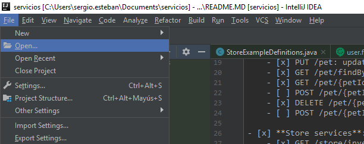
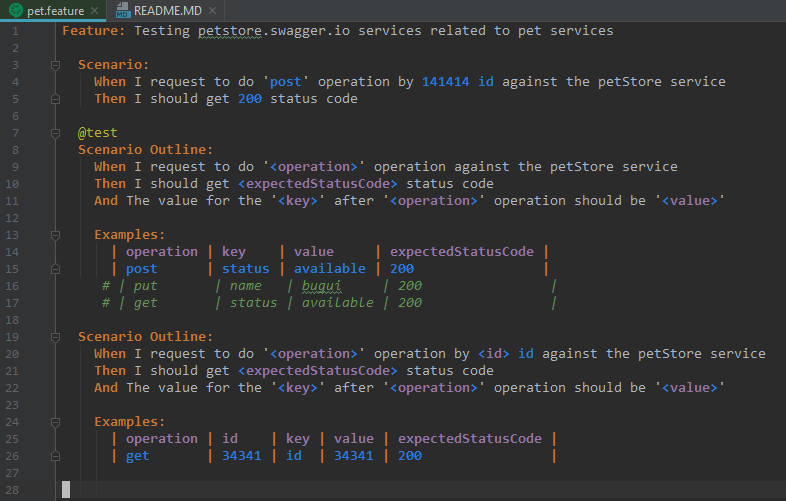
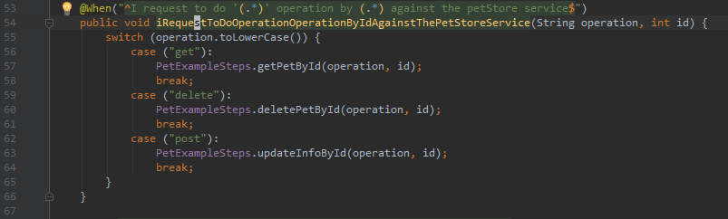
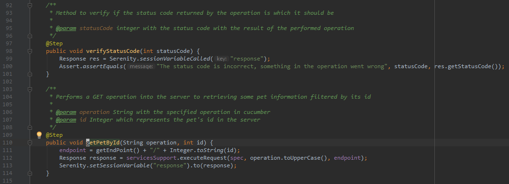
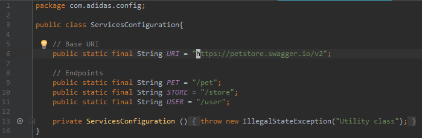
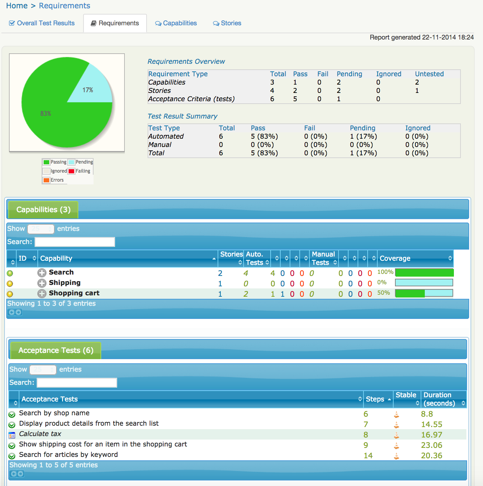

# Web services testing

In this respository you'll find an INtellij IDEA complete project with all necessary tools to develop and try your self a testing rest microservice program. The project use free web services which are accessible to all internet. The WS are: [Petstore](https://petstore.swagger.io/#/). Other free WS are: [Reqres](https://reqres.in/).


## Table of Contents

1. [Web services testing](#web-services-testing) 
2. [Table of Contents](#table-of-contents) 
3. [Tools used in the project](#tools-used-in-the-project) 
4. [Test cases implemented and tested](#test-cases-implemented-and-tested) 
5. [Project description and examples of use](#project-description-and-example-of-use) 
    1. [Project Configuration](#project-configuration) 
    2. [Code Explication and Example](#code-explication-and-example) 
        1. [Cucumber and Gherkin](#cucumber-and-gherkin) 
        2. [Example Definition for the Steps](#example-definitions-for-the-steps) 
        3. [Example Steps](#example-steps) 
        4. [Reports in Serenity BDD](#reports-of-serenity-bdd) 
        


### Tools used in the project

Tools used: 
- Intellij IDEA: is a whole Intellij IDEA project, build with gradle. An idea it's a very helpful tool for big projects.  
- Gradle: for build the project and make all the folders and settings to the project. Combined with intellij for download dependencies, they are so powerful. 
- REST Assured: libraries to testing and validate rest web services in Java. 
- Github: to have a control version and share knowledge with rest of the world.
- Postman: tool for external testing of the service. Petstore and reqres have their own example to test their own services but if you want to test some external services which doesn't provide their own example or test services [Postman](https://www.getpostman.com/) solve this problem.

### Test cases implemented and tested

Due to the large list of services offered by [Petstore](https://petstore.swagger.io/#/) it's a good idea to have some control of which services and test cases we have already coded:

- [ ] **Pet services**:
    - [x] POST /pet: insert a new pet into the store.
    - [x] PUT /pet: update the information about an existing pet into the store.
    - [x] GET /pet/findByStatus: retrieve information from the server filtered by the status.
    - [x] GET /pet/{petId}: retrieve information from the server filtered by the id.
    - [ ] POST /pet/{petId}: updates name and status information of the given pet's id into the server.
    - [x] DELETE /pet/{petId}: deletes a pet by its id.
    - [ ] POST /pet/{petId}/uploadImage: updates name, status and image information of the given pet's id into the server.

- [x] **Store services**:
    - [x] GET /store/inventory: returns pet inventories by status.
    - [x] POST /store/order: place an order for a pet.
    - [x] GET /store/order/{orderId}: finds purchased orders by id.
    - [x] DELETE /store/order/{orderId}: delete purchased order by id.


- [x] **User services**:
    - [x] POST /user: create a user.
    - [x] POST /user/createWithArray: creates list of user with given input array.
    - [x] POST /user/createWithList: creates list of user with given input list.
    - [x] GET /user/login: log user into the system.
    - [x] GET /user/logout: logout current logged in user session.
    - [x] GET /user/{username}: get user by username.
    - [x] PUT /user/{username}: update user.
    - [x] DELETE /user/{username}: delete user.


## Project Description and example of use

### Project Configuration

First of all you have to clone or download the repository to your local machine. To clone it you have to enter this command:

```$ git clone https://github.com/SergioEstebanP/QA-Testing-Microservicios-Web.git```

Once you have it in your pc open Intellij IDEA and import the project:



If you want you can open the project as a folder, you only have to select the folder with the project.

Once you have the project opened you must run the project and it's possible that you have to set up some intellij IDEA configurations before run it.

### Code Explication and example

Now you have a running version of the program. This code is designed to automation of test programs. Here I follow a **BDD** development, which means **B**ehavior **D**riven **D**evelopment. I develop the code due to the behavior of it (program fails, program succeed ...). Some tools used for BDD are [Selenium BDD](https://www.seleniumhq.org/) to Web Browser automation. In this project I use [REST Assured](http://rest-assured.io/) to Web Services automation. Also I use [Serenity BDD](http://www.thucydides.info/#/) to see the results in a proper way, serenity provides an api to see the execution results of test cases in HTML.

#### Cucumber and Gherkin

The main idea of the BDD is design the scenario of use to some program and play click to test it. First of all I use [Cucumber](https://docs.cucumber.io/) to describe these scenarios of use. Cucumber allows to write in simple and natural language a scenario of use for a program. These api provide tons of languages to write the scenarios, in this case I'll use English due to the languge use in the guide!.

Cucumber use the Gherkin Syntax, knwon as **Given, When, Then**. Which means:
- *Given*: some precondition to the program.
- *When*: the program perform some actions.
- *Then*: a given result must be validated.

This is the base of BDD.

The cucumber files are saved in .feature files. One of this files, for example is: [pet.feature](src/test/resources/features/pet/pet.features) , which looks like this:



First we have to add a feature description to the test case, which is a short text explaining the actions to achieve. Then we have to create a *Scenario*, which is form by the *Given*, *And*, *Then* and *When* sentences. The And sentence could be added to any of the other in order to add some valuable information to the scenario. Also in the Scenario we declarete the parameters for the test cases because any sentences (when, and, then sentences) are linked to a java file which contains the steps to perform in the software. 

The *Scenario* limit number of parameters to one. If you want to run another test case with other parameters you have to delete the older ones and write the new ones. One solution are the *Scenarios Outline* which provide us a table with lots of parameters to perform the test case. You write a wildcard word and then the table perform one test for parameters rows in the table. 

Now we are going to see the linked java file to Cucumber steps. 


#### Example Definitions for the Steps

If you're using Intellij IDEA you can use <Ctrl + Right Click> in the When, And or Then sentence in cucumber file to go to the [PetExampleDefinitions.java](/src/test/java/com/adidas/gherkinDefinitions/petDefinitions/PetExampleDefinitions.java) to see the code. For example use <Ctrl + Right Click> in line 4 of pet.feature, it should go to PetExampleDefinitions.java line 54, which looks like:



Here is where we catch the parameters given by the feature and process them. For example, we check the parameter, in this case a string, and then we call to another method from other class. In theory we could do all the software test in this method but it's a good practice to avoid it due to the maintenance of the code and other factors like interconnection with other classes and methods. 

You should make this separation in order to make a properly code. You have the definitions in one class, and the 'implementation' of that definitions in other class, it's like interfaces or abstract classes, you have the interface and the implementation of that interface. If we think in architectural design it's good to have this separation because we can change de implementation without change the definition or the interface. 

Now we must go to the  [PetExampleSteps.java](/src/test/java/com/adidas/serenitySteps/petSteps/PetExampleSteps.java). As I mentioned before you can use <Ctrl + Right Click> in line 57 (PetExampleSteps).

Now we are going to go through Example Steps.

#### Example Steps 

If you used <Ctrl + Right Click> your IDE must be in [PetExampleSteps.java](/src/test/java/com/adidas/serenitySteps/petSteps/PetExampleSteps.java) which looks like this:



Here is where the magic happens. You must look at between lines 102 to 115. THe first part is the Javadoc, more important than you think, you should write it in all your codes, a minimum documentation is necessary. 

The method getPetById receives two parameters from the super class which invoke the method, if you remember, the source of this parameters are the pet.features. First we redefines the **endpoint**. The endpoint is define in the class [ServicesConfiguration.java](/src/main/java/com/adidas/config/ServicesConfiguration.java). 

The definition of the base endpoint and the other ones are:



First of all, we have a template endpoint which is the base URL which provide us the services, from that endpoint we build in each request to the services the proper URL in order to do the request. For example, in this case the base URL is: *http://petstore.swagger.io/v2*, and we add the endpoint */pet* in order to execute this request, and we get the URL: *http://petstore.swagger.io/v2/pet*.

Now we have a proper endpoint and we can execute the request to the server. This operation it's done by the method executeRequest from class [ServicesSupport.java](/src/main/java/com/adidas/support/ServicesSupport.java). In my opinion this class, in this case it's not important, we can add this function in PetExampleSteps.java but as I said befor it's a good practice to separate the code in classes. In this class we only execute the request, it's perform by [RestAssured API](http://www.javadoc.io/doc/io.rest-assured/rest-assured/3.0.2). 

After perform the request we set the session variable in order to keep some results and variables of the connection, because the response will be extract from this session variable. 

Now we get at an important point, because we have done all the steps for the When sentence in the pet.feature. ¿And now what?. Now the software automatically execute the next sentence of the pet.features, in this case we do all the cycle that I describe before to the Then sentence. Once the Then sentence is done, the software go through the final And sentence to check if the result of the request is the expected one. We do this with asserts, which are sentences thath must be True, in other case the test will fail.

Now we have a complete test coded, we execute it and all it's correct. ¿We can see the results in a proper way?: Yes. Serenity BDD provide us a clear way to see the results of the test in an HTML doc.

#### Reports of Serenity BDD

Serenity BDD provide us a complete and automatic API to see the results in HTML file and open it in your favorite browser. If the test pass or fail isn't important now, Serenity will generate the reports anyway. This reports are located in [index.html](target/site/serenity/index.html), the path is: *target/site/serenity/index.html*. And if you open this file with a browser you should see something like this:



If we navigate in this page we see all the steps perform by our software in a proper way, with piecharts, tables, sliders ...

As mentioned before Serenity BDD it's only an API to see the results in a proper way. (We used for it I mean, because it has more features not used in this project).

With this tutorial you must understand the basis of automation test, Behaviour Driven Development and the software and API's used in real life projects. 
