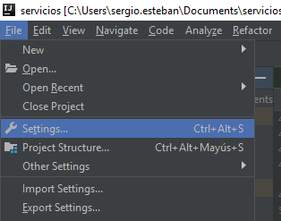

# Web services testing

In this respository you'll find an INtellij IDEA complete project with all necessary tools to develop and try your self a testing rest microservice program. The project use free web services which are accessible to all internet. The WS are: [Petstore](https://petstore.swagger.io/#/). Other free WS are: [Reqres](https://reqres.in/).

### Tools used in the project

Tools used: 
- Intellij IDEA: is a whole Intellij IDEA project, build with gradle. An idea it's a very helpfull tool for big projects.  
- Gradle: for build the project and make all the folders and settings to the project. Combined with intellij for download dependencies, they are so powerfull. 
- REST Assured: libraries to testing and validate rest web services in Java. 
- Github: to have a control version and share knowledge with rest of the world.
- Postman: tool for external testing of the service. Petstore and reqres have their own example to test their own services but if you want to test some external services which doesn't provide their own example or test services [Postman](https://www.getpostman.com/) solve this problem.

### Test cases implemented and tested

Due to the large list of servicies offered by [Petstore](https://petstore.swagger.io/#/) it's a good idea to have some control of which services and test cases we have already coded:
- [ ] **Pet services**:
    - [x] POST /pet: insert a new pet into the store.
    - [x] PUT /pet: update the information about an existing pet into the store.
    - [x] GET /pet/findByStatus: retrieve information from the server filtered by the status.
    - [x] GET /pet/{petId}: retrieve information from the server filtered by the id.
    - [ ] POST /pet/{petId}: updates name and status information of the given pet's id into the server.
    - [x] DELETE /pet/{petId}: deletes a pet by its id.
    - [ ] POST /pet/{petId}/uploadImage: updates name, status and image information of the given pet's id into the server.

- [x] **Store services**:
    - [x] GET /store/inventory: returns pet inventories by status.
    - [x] POST /store/order: place an order for a pet.
    - [x] GET /store/order/{orderId}: finds purchased orders by id.
    - [x] DELETE /store/order/{orderId}: delete purchased order by id.


- [x] **User services**:
    - [x] POST /user: create a user.
    - [x] POST /user/createWithArray: creates list of user with given input array.
    - [x] POST /user/createWithList: creates list of user with given input list.
    - [x] GET /user/login: log user into the system.
    - [x] GET /user/logout: logout current logged in user session.
    - [x] GET /user/{username}: get user by username.
    - [x] PUT /user/{username}: update user.
    - [x] DELETE /user/{username}: delete user.


## Project Description and example of use

### Project Configuration

First of all you have to clone or download the repository to your local machine. To clone it you have to enter this command:

```$ git clone https://github.com/SergioEstebanP/QA-Testing-Microservicios-Web.git```

Once you have it in your pc open Intellij IDEA and import the project:



If you want you can open the project as a folder, you only have to select the folder with the project.

Once you have the project opened you must run the project and it's possible that you have to set up some intellij IDEA configurations before run it.

### Code Explication and example

Now you have a running version of the program. This code is designed to automation of test programs. Here I follow a **BDD** development, which means **B**ehavior **D**riven **D**evelopment. I develop the code due to the behavior of it (program fails, program succeed ...). Some tools used for BDD are [Selenium BDD](https://www.seleniumhq.org/) to Web Browser automation. In this project I use [REST Assured](http://rest-assured.io/) to Web Services automation. Also I use [Serenity BDD](http://www.thucydides.info/#/) to see the results in a proper way, serenity provides an api to see the execution results of test cases in HTML.

#### Cucumber and Gherkin

The main idea of the BDD is design the scenario of use to some program and play click to test it. First of all I use [Cucumber](https://docs.cucumber.io/) to describe these scenarios of use. Cucumber allows to write in simple and natural language a scenario of use for a program. These api provide tons of languages to write the scenarios, in this case I'll use English due to the languge use in the guide!.

Cucumber use the Gherkin Syntax, knwon as **Given, When, Then**. Which means:
- *Given*: some precondition to the program.
- *When*: the program perform some actions.
- *Then*: a given result must be validated.

This is the base of BDD.

The cucumber files are saved in .feature files. One of this files, for example is: [pet.feature](src/test/resources/features/pet/pet.features) , which looks like this:


First we have to add a feature description to the test case, which is a short text explaining the actions to achieve. Then we have to create a *Scenario*, which is form by the *Given*, *And*, *Then* and *When* sentences. The And sentence could be added to any of the other in order to add some valuable information to the scenario. Also in the Scenario we declarete the parameters for the test cases because any sentences (when, and, then sentences) are linked to a java file which contains the steps to perform in the software. 

The *Scenario* limit number of parameters to one. If you want to run another test case with other parameters you have to delete the older ones and write the new ones. One solution are the *Scenarios Outline* which provide us a table with lots of parameters to perform the test case. You write a wildcard word and then the table perform one test for parameters rows in the table. 

Now we are going to see the linked java file to Cucumber steps. 


#### Example Definitions for the Steps

If you're using Intellij IDEA you can use <Ctrl + Right Click> in the When, And or Then sentence in cucumber file to go to the [PetExampleDefinitions.java](src/) to see the code. 
